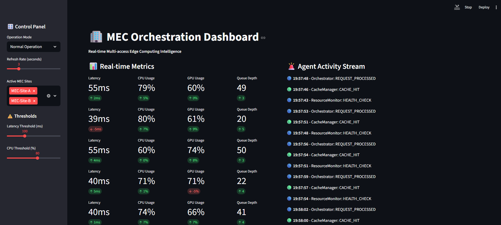
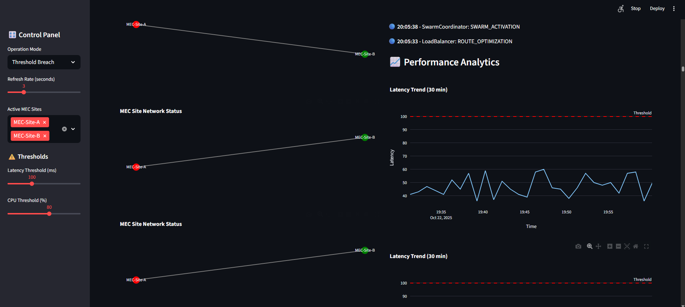

# EdgeMind: 5G-MEC Intelligence Orchestration

> 🏆 **5G Edge Computing Showcase**
> Real-time AI orchestration at telecom edge with Strands agent swarms
> https://ramsik-edgemind.streamlit.app/

## 🎯 Project Overview

**Problem**: Today’s AI systems trade speed for intelligence. Edge devices process fast but lack complexity; the cloud processes deeply but adds latency. For real-time applications—autonomous vehicles, industrial control, or competitive gaming—milliseconds matter.

**Solution**: EdgeMind brings intelligence to the edge. It deploys Strands-based multi-agent swarms directly at 5G MEC (Multi-access Edge Computing) sites. These agents monitor local metrics, detect performance degradation, and self-orchestrate routing and resource decisions—all without cloud dependence.

## 🚀 Key Innovation

- **Threshold-Based Orchestration**: Monitors latency, CPU/GPU load, and queue depth to trigger intelligent swarm responses
- **MEC-Native Intelligence**: Strands agents deployed directly at telecom edge sites near RAN controllers
- **Swarm Coordination**: Agents collaborate across MEC sites to balance load without cloud involvement
- **Real-Time Decision Making**: Sub-100ms routing decisions for time-critical applications

## 🏗️ Architecture

```
User Devices (5G) → MEC Site A (Primary) → Swarm Coordination → MEC Sites B & C (Fallback)
                           ↓
    ┌─────────────────────────────────────────────┐
    │         MEC Site A (5G Radio Tower)         │
    │  ┌─────────────────────────────────────────┐ │
    │  │    Complete Strands Agent Set           │ │
    │  │ • Orchestrator  • Load Balancer         │ │
    │  │ • Resource Mon  • Decision Coordinator  │ │
    │  │ • Cache Manager                         │ │
    │  └─────────────────────────────────────────┘ │
    │  ┌─────────────────────────────────────────┐ │
    │  │         Local MCP Tools                 │ │
    │  │ • metrics_monitor  • container_ops      │ │
    │  │ • inference_engine • telemetry_logger   │ │
    │  │ • memory_sync                           │ │
    │  └─────────────────────────────────────────┘ │
    └─────────────────────────────────────────────┘
                           ↓
              AWS Cloud (Passive Observer)
           - AgentCore Memory Only
           - AgentCore Orchestration Only
```

## 🎮 Business Use Cases

### Gaming & Esports

- **Real-time NPC dialogue**: Device SLM for instant responses
- **Game state analysis**: MEC swarm coordination for regional multiplayer
- **Performance analytics**: Cloud observability (passive)

### Autonomous Vehicles

- **Collision detection**: Device SLM for ultra-low latency safety
- **Traffic coordination**: MEC orchestrator manages regional traffic flow
- **Fleet analytics**: Cloud monitoring and long-term insights

### Smart Cities & IoT

- **Sensor processing**: Device SLM for immediate responses
- **City-wide coordination**: MEC swarm balances infrastructure load
- **Urban planning**: Cloud analytics from aggregated MEC data

## 🤖 MEC Agent Architecture

| Agent                          | Role                                    | Deployment           |
| ------------------------------ | --------------------------------------- | -------------------- |
| **Orchestrator Agent**         | Threshold monitoring & swarm triggering | MEC Site Controller  |
| **Load Balancer Agent**        | Distribute workload across MEC sites    | Strands Swarm Member |
| **Resource Monitor Agent**     | Track CPU/GPU/latency metrics           | Strands Swarm Member |
| **Decision Coordinator Agent** | Coordinate swarm consensus              | Strands Swarm Member |
| **Cache Manager Agent**        | Local model and data caching            | Strands Swarm Member |

## 🛠️ Technology Stack

- **Edge Agents**: Strands framework with Claude 3.5 Sonnet integration
- **AI Model**: Claude API for real agent coordination (optional for demo)
- **MEC Infrastructure**: Docker/Kubernetes on edge compute nodes
- **Dashboard**: Streamlit with real-time simulation
- **Orchestration**: Threshold-based swarm coordination
- **AWS Integration**: AgentCore Memory + Orchestration only
- **Communication**: Direct MEC-to-MEC networking

### **🔑 Claude API Setup (Optional)**

For full Strands agent experience:

1. Get API key: https://console.anthropic.com/
2. Create `.env` file: `ANTHROPIC_API_KEY=your-key-here`
3. Test agents: `python tests/run_all_tests.py`

**Dashboard works without API key in simulation mode!**

## 📊 Expected Outcomes

- **Sub-100ms decision making** for real-time applications
- **Autonomous load balancing** without cloud dependency
- **99.9% availability** through MEC site redundancy
- **Intelligent swarm coordination** adapting to network conditions

## 🚀 Quick Start

```bash
# Clone repository
git clone https://github.com/yourusername/mec-inference-routing.git
cd mec-inference-routing

# Install dependencies
pip install -r requirements.txt

# Launch the live dashboard
streamlit run app.py
```

**🎯 Try the Dashboard:**

1. **Normal Operation**: See healthy MEC sites (green dots)
2. **Switch to "Threshold Breach"**: Watch swarm coordination activate
3. **Try "Failover Test"**: See how system handles MEC site failure
4. **Adjust thresholds**: Test different latency/CPU limits

The dashboard shows real-time simulation of your 5G-MEC orchestration system!

## 📁 Project Structure

```text
mec-inference-routing/
├── app.py                  # Streamlit dashboard entry point
├── README.md
├── requirements.txt        # Dependencies
├── generated-diagrams/     # Architecture diagrams (Mermaid)
│   ├── mec_orchestration_architecture.mmd
│   └── threshold_breach_sequence.mmd
├── src/
│   ├── agents/            # 5 Strands agents (Orchestrator, Load Balancer, etc.)
│   ├── swarm/             # Swarm coordination logic
│   ├── mcp_tools/         # Local MCP tools (metrics, containers, inference)
│   └── dashboard/         # Streamlit UI components
├── architecture/          # Technical documentation
├── docs/                  # Business cases and technical specs
└── tests/                 # Agent and swarm tests
```

## 🏆 5G Edge Computing Showcase

### **🎯 What Makes This Special:**

- **Real 5G-MEC Architecture**: Designed for deployment at radio towers
- **Strands Agent Swarms**: 5 specialized agents per MEC site
- **Sub-100ms Performance**: Aggressive latency targets for real-time apps
- **Multi-Site Coordination**: Intelligent failover between MEC sites
- **Enterprise AWS Integration**: Only 2 services (AgentCore Memory + Orchestration)

### **🚀 Live Demo Features:**

🔗 https://ramsik-edgemind.streamlit.app/

- **Interactive Dashboard**: Real-time MEC orchestration simulation
- **Threshold Testing**: Watch swarm activation during overload
- **Failover Scenarios**: See how system handles MEC site failures
- **Performance Metrics**: Track latency, CPU, GPU, queue depth
- **Agent Activity**: Live stream of Strands agent coordination

---

## 🎛️ Live Dashboard Overview

The Streamlit dashboard simulates real-time orchestration behavior at 5G MEC sites.

🎯 **Top Left – Real-Time Metrics**

- Latency (ms) — target <100 ms
- CPU Usage — trigger >80%
- GPU Usage — monitoring utilization
- Queue Depth — request backlog
  ✅ Displays live performance indicators from simulated MEC nodes.

🤝 **Bottom Left – Swarm Visualization**

- Green: Healthy MEC sites
- Red: Overloaded sites
- Gray: Failed sites
- Lines: MEC interconnections
  ✅ Visualizes agent coordination and failover behavior.

🚨 **Top Right – Agent Activity Stream**

- 🔵 Info: Normal operations
- 🟢 Success: Consensus achieved
- 🟡 Warning: Threshold breach
- 🔴 Error: System failure
  ✅ Shows live Strands agent events.

📈 **Bottom Right – Performance Analytics**

- Blue line: Real latency
- Red line: 100 ms threshold
  ✅ Demonstrates sub-100 ms orchestration goal.

🎚 **Sidebar Controls**

- **Dashboard Mode**: Mock Data Mode vs Real Strands Agents Mode
- **Demo Scenarios**: Gaming, Automotive, Healthcare, Normal
- **Automated Demo**: 15-second scenario transitions with ▶️ Start/⏹️ Stop
- **Operation Mode**: Normal / Threshold Breach / Swarm Active / Failover Test
- Active MEC Sites toggle
- Adjustable Latency/CPU thresholds

🧪 **Enhanced Demo Scenarios**

- “Threshold Breach”: triggers swarm response
- “Swarm Active”: shows coordination logs
- “Failover Test”: disables one MEC site
  ✅ Replicates telecom-grade orchestration under stress.

**Scenario Types:**

- **🎮 Gaming**: High GPU usage (85-95%), multiplayer synchronization, NPC AI processing
- **🚗 Automotive**: Ultra-low latency (<30ms), safety-critical systems, V2X communication
- **🏥 Healthcare**: Patient monitoring (50-200 patients), HIPAA compliance, medical alerts
- **🔄 Normal**: Balanced resource utilization and standard MEC operations

🎬 **Automated Demo Features**

- **Auto Demo Mode**: Cycles through all scenarios every 15 seconds
- **Scenario-Specific Metrics**: Context-aware thresholds and performance indicators
- **Enhanced Visualizations**: Scenario-specific icons, colors, and coordination patterns
- **Real-Time Integration**: Works seamlessly in both Mock and Real agent modes
  ✅ Demonstrates comprehensive MEC orchestration across diverse use cases.





---

## What’s Next — Toward ICEO (Intelligence-Centric Edge Orchestration)

The next phase extends toward ICEO, where each MEC site acts as a learning agent within a distributed intelligence fabric.
Planned research and implementation:

- Build multi-MEC simulation for latency and consensus testing
- Add reinforcement-based learning between edge and cloud layers
- Formalize and publish ICEO as a framework for autonomous 5G orchestration

---

> _Showcasing the future of 5G-MEC intelligence - where real decisions happen at the edge, not in the cloud_
