# Enterprise AWS Deployment Architecture

## Overview

This document outlines the enterprise-scale AWS deployment architecture for the EdgeMind MEC Inference Routing system, showing the progression from local demo to production enterprise deployment.

## Architecture Diagram

```mermaid
graph TB
    %% User Devices Layer
    subgraph "Edge Devices"
        UD1[Mobile Devices]
        UD2[IoT Sensors]
        UD3[AR/VR Headsets]
        UD4[Autonomous Vehicles]
    end

    %% MEC Sites Layer (Edge Computing)
    subgraph "MEC Sites (Edge)"
        subgraph "MEC Site A"
            MSA_K8S[EKS Cluster]
            MSA_AGENTS[Strands Agents]
            MSA_CACHE[Model Cache]
            MSA_MCP[MCP Tools]
        end

        subgraph "MEC Site B"
            MSB_K8S[EKS Cluster]
            MSB_AGENTS[Strands Agents]
            MSB_CACHE[Model Cache]
            MSB_MCP[MCP Tools]
        end

        subgraph "MEC Site C"
            MSC_K8S[EKS Cluster]
            MSC_AGENTS[Strands Agents]
            MSC_CACHE[Model Cache]
            MSC_MCP[MCP Tools]
        end
    end

    %% AWS Cloud Services Layer
    subgraph "AWS Cloud (Enterprise)"
        subgraph "Compute & Orchestration"
            EKS[Amazon EKS<br/>Central Orchestration]
            FARGATE[AWS Fargate<br/>Serverless Agents]
            LAMBDA[AWS Lambda<br/>Event Processing]
        end

        subgraph "AI/ML Services"
            BEDROCK[Amazon Bedrock<br/>AgentCore Memory]
            SAGEMAKER[Amazon SageMaker<br/>Model Training]
            COMPREHEND[Amazon Comprehend<br/>NLP Processing]
        end

        subgraph "Data & Storage"
            DYNAMODB[Amazon DynamoDB<br/>Swarm State]
            S3[Amazon S3<br/>Model Storage]
            ELASTICACHE[Amazon ElastiCache<br/>Distributed Cache]
            RDS[Amazon RDS<br/>Telemetry Data]
        end

        subgraph "Monitoring & Observability"
            CLOUDWATCH[Amazon CloudWatch<br/>Metrics & Logs]
            XRAY[AWS X-Ray<br/>Distributed Tracing]
            OPENSEARCH[Amazon OpenSearch<br/>Log Analytics]
        end

        subgraph "Networking & Security"
            VPC[Amazon VPC<br/>Network Isolation]
            ALB[Application Load Balancer<br/>Traffic Distribution]
            APIGATEWAY[API Gateway<br/>Edge API Management]
            IAM[AWS IAM<br/>Access Control]
        end
    end

    %% Data Flow Connections
    UD1 --> MSA_K8S
    UD2 --> MSB_K8S
    UD3 --> MSC_K8S
    UD4 --> MSA_K8S

    %% MEC to Cloud Connections
    MSA_AGENTS --> BEDROCK
    MSB_AGENTS --> BEDROCK
    MSC_AGENTS --> BEDROCK

    MSA_MCP --> DYNAMODB
    MSB_MCP --> DYNAMODB
    MSC_MCP --> DYNAMODB

    MSA_CACHE --> S3
    MSB_CACHE --> S3
    MSC_CACHE --> S3

    MSA_K8S --> CLOUDWATCH
    MSB_K8S --> CLOUDWATCH
    MSC_K8S --> CLOUDWATCH

    %% Inter-MEC Communication
    MSA_AGENTS <--> MSB_AGENTS
    MSB_AGENTS <--> MSC_AGENTS
    MSA_AGENTS <--> MSC_AGENTS

    %% Cloud Service Integrations
    EKS --> DYNAMODB
    EKS --> BEDROCK
    LAMBDA --> DYNAMODB
    LAMBDA --> BEDROCK

    BEDROCK --> S3
    SAGEMAKER --> S3

    CLOUDWATCH --> OPENSEARCH
    XRAY --> OPENSEARCH

    ALB --> EKS
    APIGATEWAY --> ALB

    style UD1 fill:#e1f5fe
    style UD2 fill:#e1f5fe
    style UD3 fill:#e1f5fe
    style UD4 fill:#e1f5fe

    style MSA_K8S fill:#f3e5f5
    style MSB_K8S fill:#f3e5f5
    style MSC_K8S fill:#f3e5f5

    style BEDROCK fill:#fff3e0
    style EKS fill:#fff3e0
    style DYNAMODB fill:#fff3e0
    style CLOUDWATCH fill:#fff3e0
```

## Deployment Progression

### 1. Local Demo Environment

**Components:**

- Single machine running Docker containers
- Simulated MEC sites as separate containers
- Local Streamlit dashboard
- File-based state storage
- Mock MCP tools with simulation data

**Purpose:**

- Proof of concept demonstration
- Algorithm validation
- UI/UX testing
- Development and debugging

### 2. Staging Environment

**Components:**

- AWS EKS cluster with 3 nodes
- DynamoDB for state management
- CloudWatch for basic monitoring
- S3 for model storage
- Basic Bedrock AgentCore integration

**Purpose:**

- Integration testing
- Performance validation
- Security testing
- Load testing with simulated traffic

### 3. Production Enterprise Environment

**Components:**

- Multi-region AWS deployment
- Auto-scaling EKS clusters
- Full Bedrock AgentCore Memory integration
- Comprehensive monitoring and alerting
- Enterprise security and compliance
- High availability and disaster recovery

## Data Flow Architecture

### Edge to MEC Flow

1. **User Devices** → **MEC Sites**: Direct inference requests
2. **MEC Sites** → **AWS Cloud**: Coordination state, telemetry, model updates
3. **AWS Cloud** → **MEC Sites**: Orchestration decisions, model distributions

### Swarm Coordination Flow

1. **Threshold Breach Detection**: MEC site metrics exceed thresholds
2. **Swarm Activation**: Orchestrator triggers consensus via Bedrock AgentCore
3. **Consensus Coordination**: Agents vote using DynamoDB state synchronization
4. **Decision Execution**: Selected MEC site scales via EKS/Fargate
5. **Telemetry Logging**: All activities logged to CloudWatch/OpenSearch

### Model Caching Flow

1. **Predictive Preloading**: ML models predict usage patterns
2. **Cache Coordination**: Agents coordinate via ElastiCache
3. **Model Distribution**: S3 distributes models to MEC sites
4. **Cache Optimization**: Bedrock AgentCore learns optimal patterns

## AWS Service Mapping

### Core Services

| Component            | Local Demo     | Staging       | Production             |
| -------------------- | -------------- | ------------- | ---------------------- |
| **Orchestration**    | Docker Compose | EKS Basic     | EKS Multi-AZ           |
| **State Management** | JSON Files     | DynamoDB      | DynamoDB Global Tables |
| **Model Storage**    | Local Files    | S3 Standard   | S3 + CloudFront        |
| **Caching**          | In-Memory      | ElastiCache   | ElastiCache Cluster    |
| **Monitoring**       | Console Logs   | CloudWatch    | CloudWatch + X-Ray     |
| **AI Memory**        | Simulation     | Bedrock Basic | Bedrock AgentCore      |

### Scaling Characteristics

| Metric                | Local Demo  | Staging   | Production  |
| --------------------- | ----------- | --------- | ----------- |
| **MEC Sites**         | 3 simulated | 3 real    | 10-50 sites |
| **Concurrent Users**  | 1-10        | 100-1K    | 10K-100K    |
| **Requests/Second**   | 10-100      | 1K-10K    | 100K-1M     |
| **Model Cache Size**  | 1-5 GB      | 50-100 GB | 1-10 TB     |
| **Response Time SLA** | <1s         | <100ms    | <50ms       |

## Security Architecture

### Network Security

- **VPC Isolation**: Separate VPCs for different environments
- **Security Groups**: Restrictive ingress/egress rules
- **NACLs**: Additional network-level protection
- **Private Subnets**: MEC coordination in private networks

### Identity & Access Management

- **IAM Roles**: Service-specific permissions
- **RBAC**: Role-based access for agents
- **Service Mesh**: mTLS between services
- **Secrets Manager**: Secure credential storage

### Data Protection

- **Encryption at Rest**: S3, DynamoDB, EBS encryption
- **Encryption in Transit**: TLS 1.3 for all communications
- **Key Management**: AWS KMS for key rotation
- **Data Classification**: Sensitive data handling

## Cost Optimization

### Resource Optimization

- **Spot Instances**: For non-critical workloads
- **Auto Scaling**: Dynamic resource allocation
- **Reserved Instances**: For predictable workloads
- **Fargate**: Serverless for variable loads

### Storage Optimization

- **S3 Intelligent Tiering**: Automatic cost optimization
- **DynamoDB On-Demand**: Pay-per-request pricing
- **ElastiCache Reserved**: Cost savings for persistent cache

## Disaster Recovery

### High Availability

- **Multi-AZ Deployment**: Automatic failover
- **Cross-Region Replication**: DynamoDB Global Tables
- **Load Balancing**: ALB with health checks
- **Auto Scaling**: Automatic capacity management

### Backup & Recovery

- **Automated Backups**: DynamoDB point-in-time recovery
- **S3 Cross-Region Replication**: Model redundancy
- **EKS Cluster Backup**: Configuration and state backup
- **RTO/RPO Targets**: <15 minutes RTO, <5 minutes RPO

## Migration Path

### Phase 1: Foundation (Weeks 1-4)

- Set up AWS accounts and basic infrastructure
- Deploy EKS clusters and networking
- Implement basic monitoring and logging
- Migrate core MCP tools to cloud

### Phase 2: Integration (Weeks 5-8)

- Integrate Bedrock AgentCore Memory
- Implement DynamoDB state management
- Set up S3 model distribution
- Deploy staging environment

### Phase 3: Optimization (Weeks 9-12)

- Performance tuning and optimization
- Security hardening and compliance
- Disaster recovery implementation
- Production deployment preparation

### Phase 4: Production (Weeks 13-16)

- Production deployment and validation
- Load testing and performance verification
- Monitoring and alerting setup
- Documentation and training

## Monitoring & Observability

### Key Metrics

- **Swarm Coordination Time**: <100ms target
- **Consensus Success Rate**: >99% target
- **MEC Site Health**: Real-time status
- **Model Cache Hit Rate**: >85% target
- **End-to-End Latency**: <50ms target

### Alerting Strategy

- **Critical Alerts**: Swarm failures, site outages
- **Warning Alerts**: Performance degradation, capacity issues
- **Info Alerts**: Successful coordinations, cache updates

### Dashboards

- **Executive Dashboard**: High-level KPIs and business metrics
- **Operations Dashboard**: Real-time system health and performance
- **Developer Dashboard**: Detailed technical metrics and logs

## Compliance & Governance

### Regulatory Compliance

- **GDPR**: Data privacy and user consent
- **SOC 2**: Security and availability controls
- **HIPAA**: Healthcare data protection (if applicable)
- **FedRAMP**: Government deployment requirements

### Governance Framework

- **Change Management**: Controlled deployment processes
- **Access Control**: Principle of least privilege
- **Audit Logging**: Comprehensive activity tracking
- **Cost Management**: Budget controls and optimization

This enterprise architecture provides a scalable, secure, and cost-effective foundation for deploying the EdgeMind MEC Inference Routing system at enterprise scale, with clear migration paths from local demo to production deployment.
