# EdgeMind - 5G-MEC Intelligence Orchestration Architecture

## System Overview

```mermaid
graph TB
    %% Device Layer
    subgraph DeviceLayer["🌐 Device Layer (First Line)"]
        DeviceSLM["📱<br/>Device SLM<br/>• Immediate Response<br/>• Local Processing<br/>• MEC Triggers"]
        IoTSensors["🔧<br/>IoT Sensors<br/>• Edge Devices<br/>• Mobile Apps<br/>• Basic AI"]
        EdgeDevices["📟<br/>Edge Devices<br/>• Real-time Data<br/>• Local Decisions<br/>• <50ms Latency"]
    end

    %% MEC Layer - Core Intelligence
    subgraph MECLayer["🏢 MEC Layer (Primary Intelligence)"]
        subgraph OrchestratorLayer["🎯 Orchestrator Layer"]
            OrchestratorAgent["🤖<br/>Orchestrator Agent<br/>(Primary)"]
            ThresholdMonitor["📊<br/>Threshold Monitoring<br/>• Latency: <100ms<br/>• CPU/GPU: <80%<br/>• Queue: <50 reqs"]
        end

        subgraph SwarmLayer["🤝 Strands Swarm Agents"]
            LoadBalancer["⚖️<br/>Load Balance Agent<br/>• MEC Site Selection<br/>• Dynamic Balancing<br/>• Failover Logic"]
            ResourceMonitor["📈<br/>Resource Monitor<br/>• Capacity Tracking<br/>• Latency Monitor<br/>• Health Checks"]
            DecisionCoord["🧠<br/>Decision Coordinator<br/>• Swarm Consensus<br/>• Pattern Learning<br/>• Threshold Adjust"]
            CacheManager["💾<br/>Cache Manager<br/>• Local Caching<br/>• 15min Refresh<br/>• Predictive Preload"]
        end

        subgraph Infrastructure["🏗️ MEC Infrastructure"]
            ContainerRuntime["🐳<br/>Container Runtime<br/>• Docker Containers<br/>• Kubernetes<br/>• Auto Scaling"]
            LocalStorage["💽<br/>Local Storage<br/>• Local Cache<br/>• Model Storage<br/>• Response Cache"]
            MECNetwork["🌐<br/>MEC-to-MEC Network<br/>• Direct MEC Comm<br/>• Low Latency<br/>• Redundant Paths"]
        end
    end

    %% Cloud Layer
    subgraph CloudLayer["☁️ Cloud Layer (Passive Observer)"]
        Analytics["📊<br/>Analytics Only<br/>• Long-term Analytics<br/>• Pattern Recognition<br/>• Observability<br/>• No Real-time Decisions"]
        DataAggregation["📈<br/>Data Aggregation<br/>• Historical Data<br/>• Trend Analysis<br/>• Compliance Reporting"]
    end

    %% Orchestration Flow
    subgraph OrchFlow["⚡ Orchestration Flow"]
        Step1["1️⃣ Device SLM Processing"]
        Step2["2️⃣ Threshold Monitoring"]
        Step3["3️⃣ Swarm Trigger"]
        Step4["4️⃣ Load Balancing"]
        Step5["5️⃣ MEC Coordination"]
        Step6["6️⃣ Response & Learning"]
    end

    %% Primary Data Flow
    DeviceSLM -->|"Trigger MEC"| OrchestratorAgent
    IoTSensors -->|"Sensor Data"| OrchestratorAgent
    EdgeDevices -->|"Real-time Requests"| OrchestratorAgent

    %% Orchestrator Coordination
    OrchestratorAgent --> ThresholdMonitor
    ThresholdMonitor -->|"Threshold Breach"| LoadBalancer

    %% Swarm Coordination
    LoadBalancer --> ResourceMonitor
    ResourceMonitor --> DecisionCoord
    DecisionCoord --> CacheManager
    LoadBalancer --> CacheManager

    %% Infrastructure Integration
    OrchestratorAgent --> ContainerRuntime
    CacheManager --> LocalStorage
    LoadBalancer --> MECNetwork

    %% Passive Cloud Observation
    ResourceMonitor -.->|"Metrics"| Analytics
    DecisionCoord -.->|"Decisions"| DataAggregation

    %% Orchestration Flow Connections
    Step1 --> Step2
    Step2 --> Step3
    Step3 --> Step4
    Step4 --> Step5
    Step5 --> Step6

    %% Styling
    classDef deviceStyle fill:#e8f5e8,stroke:#4caf50,stroke-width:2px
    classDef mecStyle fill:#e3f2fd,stroke:#2196f3,stroke-width:2px
    classDef swarmStyle fill:#f3e5f5,stroke:#9c27b0,stroke-width:2px
    classDef cloudStyle fill:#fff3e0,stroke:#ff9800,stroke-width:2px
    classDef flowStyle fill:#fce4ec,stroke:#e91e63,stroke-width:2px
    classDef infraStyle fill:#f1f8e9,stroke:#689f38,stroke-width:2px

    class DeviceLayer,DeviceSLM,IoTSensors,EdgeDevices deviceStyle
    class MECLayer,OrchestratorLayer,OrchestratorAgent,ThresholdMonitor mecStyle
    class SwarmLayer,LoadBalancer,ResourceMonitor,DecisionCoord,CacheManager swarmStyle
    class CloudLayer,Analytics,DataAggregation cloudStyle
    class OrchFlow,Step1,Step2,Step3,Step4,Step5,Step6 flowStyle
    class Infrastructure,ContainerRuntime,LocalStorage,MECNetwork infraStyle
```

### Three-Layer Intelligence Model

```mermaid
graph LR
    subgraph Layer1["🌐 Device Layer (First Line)"]
        Device["📱 Small Language Models<br/>🎯 Role: Trigger<br/>⚡ Latency: <50ms<br/>🤖 Autonomy: Basic<br/><br/>• Immediate Response<br/>• Local Processing<br/>• Triggers MEC<br/>• IoT Devices<br/>• Mobile Apps<br/>• Basic AI"]
    end

    subgraph Layer2["🏢 MEC Layer (Primary Intelligence)"]
        MEC["🤝 Strands Swarm Orchestration<br/>🎯 Role: Intelligence<br/>⚡ Latency: <100ms<br/>🤖 Autonomy: Full<br/><br/>• Real-time Decisions<br/>• Swarm Coordination<br/>• Load Balance<br/>• Autonomous Operation<br/>• 5G RAN Controllers<br/>• Containerized Deployment"]
    end

    subgraph Layer3["☁️ Cloud Layer (Passive Observer)"]
        Cloud["📊 Analytics Only<br/>🎯 Role: Observer<br/>⚡ Latency: N/A<br/>🤖 Autonomy: None<br/><br/>• Long-term Analytics<br/>• Pattern Recognition<br/>• Observability<br/>• No Real-time Decisions<br/>• Historical Data<br/>• Compliance Reporting"]
    end

    Device -->|"Complex Requests"| MEC
    MEC -.->|"Metrics & Logs"| Cloud

    classDef deviceStyle fill:#e8f5e8,stroke:#4caf50,stroke-width:3px
    classDef mecStyle fill:#e3f2fd,stroke:#2196f3,stroke-width:3px
    classDef cloudStyle fill:#fff3e0,stroke:#ff9800,stroke-width:3px

    class Layer1,Device deviceStyle
    class Layer2,MEC mecStyle
    class Layer3,Cloud cloudStyle
```

## Key Architecture Principles

### 1. Threshold-Based Orchestration

- **Real-time Monitoring**: Continuous tracking of latency, CPU/GPU load, and queue depth
- **Swarm Triggering**: Automatic activation of Strands agent swarms when thresholds exceeded
- **Autonomous Decisions**: No cloud dependency for real-time decision making
- **Sub-100ms Response**: Target latency for all orchestration decisions

### 2. Three-Layer Intelligence Strategy

- **Device Layer**: Small Language Models (SLMs) for immediate response and MEC triggering
- **MEC Layer**: Primary intelligence with Strands swarm coordination and load balancing
- **Cloud Layer**: Passive observer for analytics and long-term pattern recognition

### 3. Swarm Coordination

- **Consensus-Based**: Multi-agent decision making across MEC sites
- **Load Balancing**: Dynamic distribution of workload based on real-time capacity
- **Fault Tolerance**: Automatic failover between MEC sites without cloud involvement
- **Learning Adaptation**: Continuous threshold adjustment based on performance patterns

### 4. MEC-Native Deployment

- **Container Orchestration**: Docker/Kubernetes deployment at MEC sites
- **Direct MEC Communication**: Low-latency networking between MEC sites
- **Local Caching**: 15-minute refresh cycles with predictive preloading
- **Edge Autonomy**: Complete independence from cloud for operational decisions

## MEC Orchestration Flow Summary

1. **Device Processing**: SLM handles immediate response, triggers MEC if complexity threshold exceeded
2. **Threshold Monitoring**: Orchestrator Agent continuously monitors latency, load, and queue metrics
3. **Swarm Activation**: When thresholds breached, Strands swarm coordination is triggered
4. **Load Balancing**: Swarm agents coordinate to select optimal MEC site for processing
5. **MEC Execution**: Selected MEC site processes request with local cached models
6. **Swarm Learning**: Decision Coordinator learns from outcomes and adjusts thresholds
7. **Cloud Observation**: Passive aggregation of metrics for long-term analytics (no real-time decisions)

## Competitive Advantages

- **True Edge Intelligence**: Real decisions made at MEC sites, not dependent on cloud connectivity
- **Sub-100ms Orchestration**: Threshold-based swarm coordination for real-time applications
- **Autonomous Operation**: Complete MEC autonomy with cloud as passive observer only
- **5G-Native Design**: Optimized for deployment near RAN controllers and 5G infrastructure
- **Swarm Resilience**: Multi-agent coordination provides redundancy and fault tolerance
