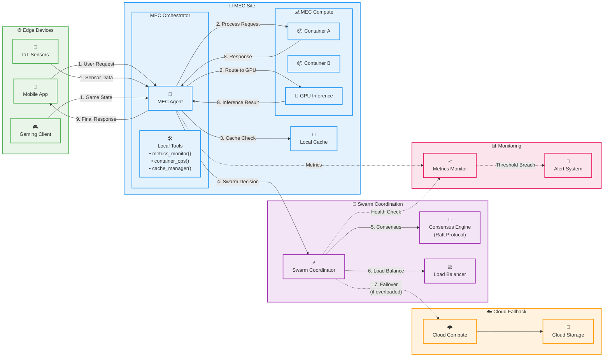

# MEC Orchestration Architecture

## Architecture Overview

This diagram shows a professional MEC (Multi-access Edge Computing) orchestration architecture focused on **MEC sites** rather than AgentCore Runtime, following AWS architectural diagram standards.

### Key Components

#### 🌐 Edge Devices

- **Mobile Apps**: Consumer applications requiring low-latency responses
- **IoT Sensors**: Industrial sensors with real-time data requirements
- **Gaming Clients**: Interactive applications with strict latency constraints

#### 🏢 MEC Site (Primary Processing)

- **MEC Agent**: Local orchestrator running on MEC infrastructure
- **Local Tools**: MEC-specific tools (metrics_monitor, container_ops, cache_manager)
- **MEC Compute**: Edge computing resources with containers and GPU inference
- **Local Cache**: Fast local storage for frequently accessed data

#### 🤝 Swarm Coordination

- **Swarm Coordinator**: Multi-MEC site coordination and decision making
- **Consensus Engine**: Raft protocol implementation for distributed consensus
- **Load Balancer**: Intelligent workload distribution across MEC sites

#### ☁️ Cloud Fallback

- **Cloud Compute**: Backup processing when MEC sites are overloaded
- **Cloud Storage**: Centralized data persistence and backup

#### 📊 Monitoring & Observability

- **Metrics Monitor**: Real-time performance and threshold monitoring
- **Alert System**: Automated alerting for threshold breaches

### Request Flow

1. **Edge devices** send requests to the **MEC Agent**
2. **MEC Agent** processes requests using local containers and GPU
3. **Local cache** provides fast data access
4. **Swarm coordination** handles multi-site decisions via consensus
5. **Load balancing** optimizes resource utilization
6. **Monitoring** tracks performance and triggers alerts
7. **Cloud fallback** provides backup processing capacity
8. **Responses** are returned to edge devices with minimal latency

### Key Features

- **Sub-100ms Response Times**: Direct MEC site processing
- **Intelligent Orchestration**: Swarm-based coordination
- **Fault Tolerance**: Automatic cloud fallback
- **Real-time Monitoring**: Continuous performance tracking
- **Distributed Consensus**: Raft protocol for coordination
