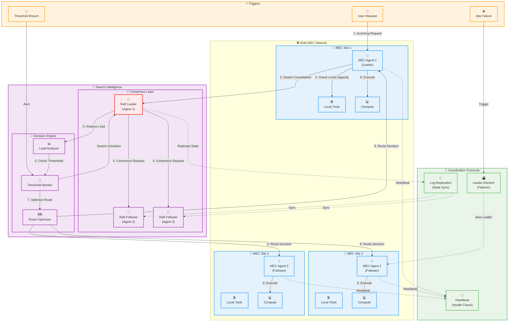

# Strands Swarm Coordination Architecture

## Strands Swarm Coordination Overview

This diagram illustrates the **Strands-inspired swarm coordination** system for MEC orchestration, showing how multiple MEC sites coordinate using distributed consensus algorithms.

### Core Components

#### 🏢 MEC Sites Network

- **MEC Agent 1 (Leader)**: Primary coordinator with leader responsibilities
- **MEC Agent 2-3 (Followers)**: Secondary agents following leader decisions
- **Local Tools**: Site-specific operational tools and capabilities
- **Compute Resources**: Local processing power at each MEC site

#### 🧠 Swarm Intelligence

- **Raft Consensus**: Distributed consensus protocol ensuring consistency
- **Load Analyzer**: Real-time analysis of resource utilization across sites
- **Threshold Monitor**: Continuous monitoring for performance breaches
- **Route Optimizer**: Intelligent routing decisions based on current conditions

#### 📡 Coordination Protocols

- **Heartbeat**: Health monitoring and liveness detection
- **Log Replication**: State synchronization across all MEC sites
- **Leader Election**: Automatic failover and new leader selection

### Swarm Coordination Flow

1. **User Request** arrives at MEC Site 1 (current leader)
2. **Local Capacity Check** determines if local processing is sufficient
3. **Swarm Consultation** initiated if coordination needed
4. **Consensus Request** sent to all follower sites
5. **Load Analysis** performed across all sites
6. **Threshold Checking** validates performance constraints
7. **Route Optimization** determines optimal processing location
8. **Decision Distribution** to all participating MEC sites
9. **Coordinated Execution** across selected sites

### Key Features

#### Distributed Consensus

- **Raft Protocol**: Ensures consistency and fault tolerance
- **Leader Election**: Automatic failover when leader fails
- **Log Replication**: Maintains synchronized state across sites

#### Intelligent Coordination

- **Real-time Load Balancing**: Dynamic resource allocation
- **Threshold-based Triggers**: Proactive swarm activation
- **Optimal Route Selection**: Minimizes latency and maximizes throughput

#### Fault Tolerance

- **Heartbeat Monitoring**: Continuous health checking
- **Automatic Failover**: Seamless leader transition
- **Graceful Degradation**: Maintains service during failures

### Swarm Activation Scenarios

1. **High Load**: When local MEC site approaches capacity limits
2. **Threshold Breach**: Performance metrics exceed defined thresholds
3. **Site Failure**: When a MEC site becomes unavailable
4. **Geographic Optimization**: When user location changes require rebalancing
