# EdgeMind Architecture Guide

## Overview

EdgeMind is a 5G-MEC intelligence orchestration system that deploys Strands agent swarms directly at Multi-access Edge Computing (MEC) sites near 5G RAN controllers. The system enables real-time AI orchestration through threshold-based monitoring and autonomous swarm coordination, ensuring sub-100ms decision making without cloud dependency for time-critical applications.

## System Architecture

### Three-Layer Intelligence Model

```mermaid
graph LR
    subgraph Layer1["🌐 Device Layer (First Line)"]
        Device["📱 Small Language Models<br/>🎯 Role: Trigger<br/>⚡ Latency: <50ms<br/>🤖 Autonomy: Basic<br/><br/>• Immediate Response<br/>• Local Processing<br/>• Triggers MEC<br/>• IoT Devices<br/>• Mobile Apps<br/>• Basic AI"]
    end

    subgraph Layer2["🏢 MEC Layer (Primary Intelligence)"]
        MEC["🤝 Strands Swarm Orchestration<br/>🎯 Role: Intelligence<br/>⚡ Latency: <100ms<br/>🤖 Autonomy: Full<br/><br/>• Real-time Decisions<br/>• Swarm Coordination<br/>• Load Balance<br/>• Autonomous Operation<br/>• 5G RAN Controllers<br/>• Containerized Deployment"]
    end

    subgraph Layer3["☁️ Cloud Layer (Passive Observer)"]
        Cloud["📊 Analytics Only<br/>🎯 Role: Observer<br/>⚡ Latency: N/A<br/>🤖 Autonomy: None<br/><br/>• Long-term Analytics<br/>• Pattern Recognition<br/>• Observability<br/>• No Real-time Decisions<br/>• Historical Data<br/>• Compliance Reporting"]
    end

    Device -->|"Complex Requests"| MEC
    MEC -.->|"Metrics & Logs"| Cloud

    classDef deviceStyle fill:#e8f5e8,stroke:#4caf50,stroke-width:3px
    classDef mecStyle fill:#e3f2fd,stroke:#2196f3,stroke-width:3px
    classDef cloudStyle fill:#fff3e0,stroke:#ff9800,stroke-width:3px

    class Layer1,Device deviceStyle
    class Layer2,MEC mecStyle
    class Layer3,Cloud cloudStyle
```



### MEC Orchestration Architecture

The system deploys identical MEC sites at 5G radio towers, each containing complete Strands agent sets:

#### 🌐 User Devices (5G Connected)

- **Mobile Apps**: Consumer applications requiring low-latency responses
- **IoT Sensors**: Industrial sensors with real-time data requirements
- **Gaming Clients**: Interactive applications with strict latency constraints
- **Autonomous Vehicles**: V2X communication requiring ultra-low latency

#### 📡 MEC Sites (Multiple Identical Sites at 5G Radio Towers)

Each MEC site contains:

**Complete Strands Agent Set**:

- **Orchestrator Agent**: Threshold monitoring and request handling
- **Load Balancer Agent**: Workload distribution decisions
- **Resource Monitor Agent**: Performance metrics tracking
- **Decision Coordinator Agent**: Swarm consensus coordination
- **Cache Manager Agent**: Local model and data caching

**Local MCP Tools** (running locally at each site):

- **metrics_monitor**: MEC site performance monitoring
- **container_ops**: Local container scaling operations
- **inference_engine**: Model caching and execution
- **telemetry_logger**: Structured event logging
- **memory_sync**: Swarm state synchronization

**Local Edge Compute**:

- **Containers**: Docker/Kubernetes local deployment
- **Model Cache**: Local storage for frequently used models

#### ☁️ AWS Cloud (Passive Observer Only)

- **AgentCore Memory**: Swarm state storage and learning
- **AgentCore Orchestration**: Agent coordination services

## Agent Architecture

### Strands Agent Specialization

| Agent                        | Role                  | MCP Tools                      | Responsibilities                       |
| ---------------------------- | --------------------- | ------------------------------ | -------------------------------------- |
| **OrchestratorAgent**        | Primary controller    | metrics_monitor, memory_sync   | Threshold monitoring, swarm triggering |
| **LoadBalancerAgent**        | Workload distribution | metrics_monitor, container_ops | MEC site selection, load balancing     |
| **ResourceMonitorAgent**     | Performance tracking  | metrics_monitor, telemetry     | Capacity monitoring, health checks     |
| **DecisionCoordinatorAgent** | Consensus management  | memory_sync, telemetry         | Swarm consensus, pattern learning      |
| **CacheManagerAgent**        | Model caching         | inference, telemetry           | Local caching, predictive preloading   |

### Agent Interaction Flow

```mermaid
sequenceDiagram
    participant Device as 📱 Device
    participant Orch as 🎯 Orchestrator
    participant LB as ⚖️ Load Balancer
    participant RM as 📈 Resource Monitor
    participant DC as 🧠 Decision Coordinator
    participant CM as 💾 Cache Manager

    Device->>Orch: Request (complexity threshold exceeded)
    Orch->>RM: Check MEC site metrics
    RM-->>Orch: Site performance data

    alt Threshold Breach Detected
        Orch->>DC: Trigger swarm coordination
        DC->>LB: Request site selection
        DC->>CM: Check model availability

        LB->>RM: Get site health scores
        RM-->>LB: Health metrics
        LB-->>DC: Recommended sites

        CM-->>DC: Model cache status
        DC->>DC: Calculate consensus
        DC-->>Orch: Swarm decision
    end

    Orch-->>Device: Response (sub-100ms)
```



## MCP Integration Layer

### Tool Architecture

Each Strands agent is backed by an MCP client that provides access to domain-specific tools:

```json
{
  "mcp_tools": {
    "metrics_monitor": {
      "endpoint": "http://metrics-service:8080",
      "functions": [
        "get_mec_metrics",
        "check_site_health",
        "monitor_thresholds"
      ],
      "synthetic_data": true,
      "simulation_mode": "realistic"
    },
    "container_ops": {
      "endpoint": "http://k8s-api:8080",
      "functions": [
        "scale_containers",
        "deploy_model",
        "restart_failed_agents"
      ],
      "synthetic_data": true,
      "simulation_mode": "kubernetes_mock"
    },
    "telemetry": {
      "endpoint": "http://telemetry-service:8080",
      "functions": ["log_decision", "send_metrics", "report_anomaly"],
      "synthetic_data": true,
      "simulation_mode": "cloud_observer"
    },
    "inference": {
      "endpoint": "http://inference-service:8080",
      "functions": ["run_local_inference", "cache_response", "preload_models"],
      "synthetic_data": true,
      "simulation_mode": "model_simulation"
    },
    "memory_sync": {
      "endpoint": "http://memory-sync:8080",
      "functions": [
        "sync_swarm_state",
        "update_consensus",
        "share_decision_context"
      ],
      "synthetic_data": true,
      "simulation_mode": "distributed_state"
    }
  }
}
```

### Agent MCP Manifests

```json
{
  "agents": {
    "orchestrator": {
      "tools": ["metrics_monitor", "container_ops", "telemetry", "memory_sync"],
      "capabilities": ["threshold_monitoring", "swarm_triggering"]
    },
    "load_balancer": {
      "tools": ["metrics_monitor", "container_ops", "memory_sync"],
      "capabilities": ["load_distribution", "failover_coordination"]
    },
    "resource_monitor": {
      "tools": ["metrics_monitor", "telemetry", "memory_sync"],
      "capabilities": ["metrics_collection", "anomaly_detection"]
    },
    "cache_manager": {
      "tools": ["inference", "telemetry", "memory_sync"],
      "capabilities": ["model_caching", "predictive_preloading"]
    },
    "decision_coordinator": {
      "tools": ["memory_sync", "telemetry", "metrics_monitor"],
      "capabilities": ["swarm_consensus", "pattern_learning"]
    }
  }
}
```

## Orchestration Flow

### Request Processing Pipeline

1. **Device Processing**: SLM handles immediate response, triggers MEC if complexity threshold exceeded
2. **Threshold Monitoring**: Orchestrator Agent continuously monitors latency, load, and queue metrics
3. **Swarm Activation**: When thresholds breached, Strands swarm coordination is triggered
4. **Load Balancing**: Swarm agents coordinate to select optimal MEC site for processing
5. **MEC Execution**: Selected MEC site processes request with local cached models
6. **Swarm Learning**: Decision Coordinator learns from outcomes and adjusts thresholds
7. **Cloud Observation**: Passive aggregation of metrics for long-term analytics (no real-time decisions)

### Threshold Configuration

```python
@dataclass
class ThresholdConfig:
    latency_threshold_ms: int = 100
    cpu_threshold_percent: float = 80.0
    gpu_threshold_percent: float = 80.0
    queue_depth_threshold: int = 50
    network_latency_threshold_ms: int = 20
```

### Swarm Consensus Algorithm

**Weighted Voting System**:

- **LoadBalancerAgent**: 30% (primary site selection expertise)
- **ResourceMonitorAgent**: 25% (performance data authority)
- **OrchestratorAgent**: 25% (overall system context)
- **CacheManagerAgent**: 20% (model availability considerations)

**Consensus Rules**:

- Minimum 60% consensus required for decision
- Minimum 3 agents must participate
- Tie-breaking defers to LoadBalancer recommendation
- Timeout after 5 seconds with fallback to highest-weighted agent

## Data Models

### Core Data Structures

```python
@dataclass
class InferenceRequest:
    request_id: str
    content: str
    complexity_score: float
    latency_requirement: int  # milliseconds
    privacy_level: PrivacyLevel
    device_capabilities: DeviceCapabilities
    timestamp: datetime

@dataclass
class MECMetrics:
    site_id: str
    cpu_utilization: float
    gpu_utilization: float
    memory_usage: float
    queue_depth: int
    network_latency: Dict[str, float]  # latency to other MEC sites
    timestamp: datetime

@dataclass
class SwarmDecision:
    decision_id: str
    selected_mec_site: str
    reasoning: str
    confidence_score: float
    fallback_sites: List[str]
    execution_time_ms: int
    timestamp: datetime
```

## Performance Targets

### Latency Requirements

- **Total Orchestration Decision**: <100ms (95th percentile)
- **Threshold Detection**: <50ms
- **Swarm Consensus**: <50ms (production with local SLMs)
- **MCP Tool Calls**: <10ms each (local deployment)
- **Graceful Degradation**: <150ms under high load

### Demo vs Production Expectations

- **Demo Mode**: 2-5 seconds (acceptable for API calls)
- **Production Mode**: <100ms (with local SLMs and MCP tools)

## Error Handling & Fault Tolerance

### Circuit Breaker Pattern

- Monitor MEC site health with 10-second intervals
- Open circuit after 3 consecutive failures
- Half-open state for gradual recovery testing
- Automatic failover to healthy MEC sites

### Graceful Degradation

- Fallback to device-only processing when MEC unavailable
- Cached response serving during MEC site failures
- Reduced functionality mode with core features only
- Automatic recovery when MEC sites return online

### Error Recovery Protocols

```python
class ErrorHandler:
    def handle_mec_site_failure(self, failed_site: str) -> RecoveryPlan
    def implement_graceful_degradation(self, failure_type: FailureType) -> DegradationStrategy
    def recover_from_network_partition(self, partition_info: PartitionInfo) -> RecoveryAction
    def handle_swarm_consensus_failure(self, consensus_error: ConsensusError) -> FallbackDecision
```

## Enterprise AWS Deployment

### Deployment Progression

#### 1. Local Demo Environment

- Single machine running Docker containers
- Simulated MEC sites as separate containers
- Local Streamlit dashboard
- File-based state storage
- Mock MCP tools with simulation data

#### 2. Staging Environment

- AWS EKS cluster with 3 nodes
- DynamoDB for state management
- CloudWatch for basic monitoring
- S3 for model storage
- Basic Bedrock AgentCore integration

#### 3. Production Enterprise Environment

- Multi-region AWS deployment
- Auto-scaling EKS clusters
- Full Bedrock AgentCore Memory integration
- Comprehensive monitoring and alerting
- Enterprise security and compliance
- High availability and disaster recovery

### AWS Service Mapping

| Component            | Local Demo     | Staging       | Production             |
| -------------------- | -------------- | ------------- | ---------------------- |
| **Orchestration**    | Docker Compose | EKS Basic     | EKS Multi-AZ           |
| **State Management** | JSON Files     | DynamoDB      | DynamoDB Global Tables |
| **Model Storage**    | Local Files    | S3 Standard   | S3 + CloudFront        |
| **Caching**          | In-Memory      | ElastiCache   | ElastiCache Cluster    |
| **Monitoring**       | Console Logs   | CloudWatch    | CloudWatch + X-Ray     |
| **AI Memory**        | Simulation     | Bedrock Basic | Bedrock AgentCore      |

### Scaling Characteristics

| Metric                | Local Demo  | Staging   | Production  |
| --------------------- | ----------- | --------- | ----------- |
| **MEC Sites**         | 3 simulated | 3 real    | 10-50 sites |
| **Concurrent Users**  | 1-10        | 100-1K    | 10K-100K    |
| **Requests/Second**   | 10-100      | 1K-10K    | 100K-1M     |
| **Model Cache Size**  | 1-5 GB      | 50-100 GB | 1-10 TB     |
| **Response Time SLA** | <1s         | <100ms    | <50ms       |

## Security Architecture

### Network Security

- **VPC Isolation**: Separate VPCs for different environments
- **Security Groups**: Restrictive ingress/egress rules
- **NACLs**: Additional network-level protection
- **Private Subnets**: MEC coordination in private networks

### Identity & Access Management

- **IAM Roles**: Service-specific permissions
- **RBAC**: Role-based access for agents
- **Service Mesh**: mTLS between services
- **Secrets Manager**: Secure credential storage

### Data Protection

- **Encryption at Rest**: S3, DynamoDB, EBS encryption
- **Encryption in Transit**: TLS 1.3 for all communications
- **Key Management**: AWS KMS for key rotation
- **Data Classification**: Sensitive data handling

## Architecture Decision Records

### Key Decisions

1. **Strands Framework Selection**: Native swarm support with MCP integration
2. **Five-Agent Specialization**: Clear separation of concerns with parallel processing
3. **MCP Tool Architecture**: Standardized infrastructure interaction (implementation pending)
4. **Weighted Consensus Algorithm**: Expertise-based decision making
5. **Threshold-Based Activation**: Performance-driven swarm coordination
6. **Async/Await Patterns**: Non-blocking operations for real-time performance
7. **Simulation-First Development**: Risk reduction with clear production migration path

### Implementation Status

| Decision              | Status      | Priority |
| --------------------- | ----------- | -------- |
| Strands Framework     | ✅ Complete | -        |
| Agent Specialization  | ✅ Complete | -        |
| MCP Tool Architecture | ✅ Complete | -        |
| Weighted Consensus    | ⚠️ Partial  | High     |
| Threshold Activation  | ✅ Complete | -        |
| Async/Await Patterns  | ✅ Complete | -        |
| Simulation-First      | ✅ Complete | -        |

## Competitive Advantages

- **True Edge Intelligence**: Real decisions made at MEC sites, not dependent on cloud connectivity
- **Sub-100ms Orchestration**: Threshold-based swarm coordination for real-time applications
- **Autonomous Operation**: Complete MEC autonomy with cloud as passive observer only
- **5G-Native Design**: Optimized for deployment near RAN controllers and 5G infrastructure
- **Swarm Resilience**: Multi-agent coordination provides redundancy and fault tolerance

## Next Steps

### Phase 2 Priorities

1. **Implement Functional MCP Tools** - Critical blocker for production deployment
2. **Complete Weighted Consensus Logic** - High priority for swarm decision quality
3. **Performance Optimization** - Production readiness with local SLMs
4. **Enhanced Fault Tolerance** - Operational excellence and reliability

### Migration Path

- **Phase 2A**: Functional MCP tools with API calls
- **Phase 2B**: Local SLM deployment for production speed
- **Phase 2C**: Edge-optimized inference for <100ms targets

## Dashboard Architecture

### Dual-Mode Operation

The Streamlit dashboard supports two operational modes:

#### Mock Data Mode (Default)

- **Purpose**: Demo without API key requirements
- **Data Source**: Realistic synthetic data generation
- **Performance**: Instant response times
- **Use Case**: Public demonstrations, development testing

#### Real Strands Agents Mode

- **Purpose**: Actual agent coordination with Claude API
- **Data Source**: Live MCP tool calls and agent responses
- **Performance**: 2-5 second response times (API calls)
- **Use Case**: Full system validation, stakeholder demos

### Dashboard Components

#### Real-Time Metrics Panel

- Live performance indicators from MEC sites
- Threshold breach detection and visualization
- Scenario-specific metric patterns
- Performance target tracking (<100ms orchestration)

#### Swarm Network Visualization

- Interactive network graph of MEC sites
- Real-time status indicators (healthy/overloaded/failed)
- Inter-MEC communication flow display
- Load balancing decision visualization

#### Agent Activity Stream

- Live stream of Strands agent coordination
- MCP tool call results and responses
- Agent conversation capture and display
- Structured event logging with filtering

#### Enhanced Demo Scenarios

- **Gaming**: High GPU usage, multiplayer coordination
- **Automotive**: Ultra-low latency, safety-critical systems
- **Healthcare**: Patient monitoring, HIPAA compliance
- **Automated Demo**: 15-second scenario transitions

### Session Management

- Persistent state across browser sessions
- Demo data caching and continuity
- User preference storage
- Performance metrics history

## Current Implementation Status

### ✅ Completed Features

#### Core Infrastructure

- **Strands Agent Framework**: All 5 specialized agents implemented
- **MCP Tool Integration**: Complete tool suite (metrics_monitor, container_ops, inference_engine, telemetry_logger, memory_sync)
- **Threshold Monitoring**: Real-time breach detection and swarm triggering
- **Dual-Mode Dashboard**: Mock and Real agent modes operational

#### Agent Coordination

- **SwarmCoordinator**: Functional with Claude integration
- **Agent Conversation Capture**: Real-time agent response display
- **Performance Tracking**: Sub-100ms orchestration monitoring
- **Event Logging**: Comprehensive activity stream

#### Demo Capabilities

- **Enhanced Scenarios**: Gaming, Automotive, Healthcare, Normal
- **Automated Demo Mode**: 15-second transitions with visual indicators
- **Interactive Controls**: Real-time threshold adjustment
- **Performance Visualization**: Live metrics and coordination display

### ⚠️ Partial Implementation

#### Advanced Features

- **Weighted Consensus Logic**: System prompts defined, voting logic needs implementation
- **AWS AgentCore Memory**: Integration planned for production deployment
- **Performance Optimization**: Current focus on functionality over speed optimization

### ❌ Planned Features

#### Production Readiness

- **Local SLM Deployment**: For production <100ms targets
- **AWS Wavelength Integration**: 5G edge deployment
- **Enhanced Error Handling**: Circuit breaker patterns and graceful degradation
- **Multi-MEC Site Simulation**: Cross-site coordination testing

## Technology Stack (Current)

### Core Framework

- **Python 3.11**: Async/await patterns for real-time processing
- **Strands Agents**: Multi-agent coordination with Claude 3.5 Sonnet
- **Streamlit**: Interactive dashboard with dual-mode operation
- **MCP Protocol**: Tool integration for infrastructure interaction

### Agent Infrastructure

- **AnthropicModel**: Claude API integration for agent reasoning
- **Async Coordination**: Non-blocking swarm operations
- **Structured Logging**: Comprehensive event tracking
- **Session State**: Persistent dashboard state management

### Data Management

- **JSON Persistence**: Session data and metrics history
- **Synthetic Data Generation**: Realistic MEC metrics simulation
- **Real-time Streaming**: Live agent activity and performance data
- **Demo Data Caching**: Scenario-specific patterns and behaviors

This architecture provides a scalable, secure, and performant foundation for deploying intelligent agent swarms at 5G MEC sites, enabling real-time AI orchestration without cloud dependency.
